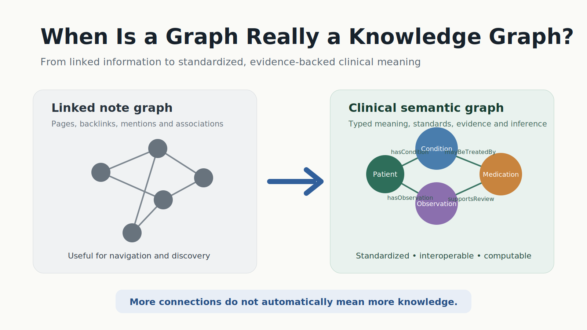
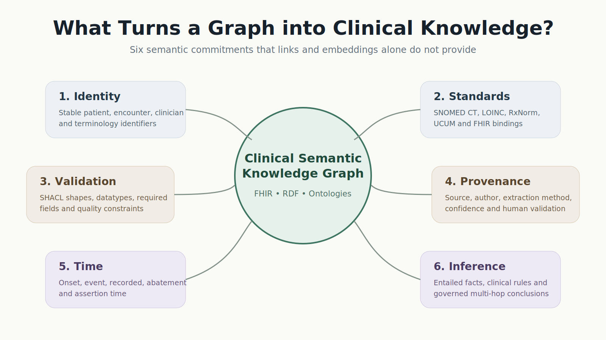
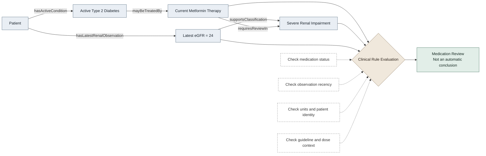
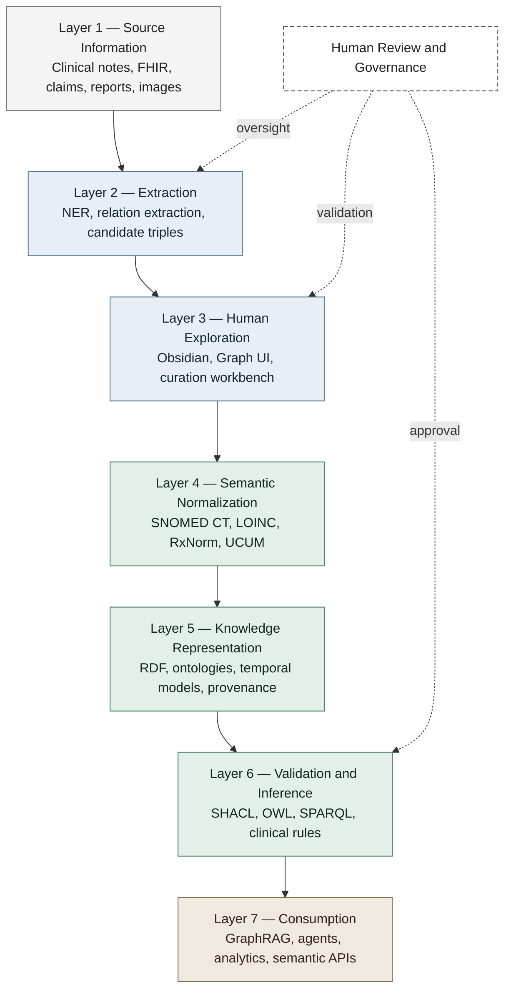

# When Is a Graph Really a Knowledge Graph?

## Why Obsidian, Graphify, RDF, and healthcare knowledge graphs are not the same thing

Open Obsidian’s Graph View and the result is immediately compelling: notes appear as nodes, links become edges, and clusters emerge from what previously looked like an ordinary collection of Markdown files.

Feed documents into a graph-generation tool and something apparently more sophisticated may emerge: entities, topics, passages, and relationships become a traversable network.

Both are frequently described as **knowledge graphs**.

Then consider an RDF-based healthcare knowledge graph representing patients, diagnoses, laboratory observations, medications, encounters, clinical guidelines, and biomedical ontologies.

It also consists of nodes and edges.

At a visual level, these systems can look remarkably similar. At a computational level, however, they may represent fundamentally different things.

The mistake is to assume that once information has been rendered as a graph, it has acquired semantics, interoperability, or reasoning capability.

It has not.

> A graph shows that two things are connected. A semantic knowledge graph defines what those things are, what the connection means, and what conclusions may legitimately follow from it.

That distinction becomes especially important in healthcare, where an ambiguous relationship is not merely inconvenient. It can produce an incorrect interpretation of a patient’s clinical state.

---

## Obsidian creates a graph of information objects

Obsidian’s Graph View visualizes relationships between notes in a vault. Its backlinks provide navigation from one note to other notes that refer to it [1], [2].

Suppose a physician-researcher maintains these notes:

```text
Type 2 Diabetes
HbA1c
Metformin
Chronic Kidney Disease
Patient John Smith
```

After adding links among them, Obsidian might display:

```text
Patient John Smith
      │
      ├── Type 2 Diabetes
      ├── HbA1c
      ├── Metformin
      └── Chronic Kidney Disease
```

This is useful. The graph helps the user navigate related notes, discover clusters, identify highly connected topics, organize research, and retrieve contextual material.

However, the default relationship is essentially:

```text
Note A links to Note B
```

The edge usually does not formally distinguish between:

```text
John has diabetes
John was screened for diabetes
John has a family history of diabetes
John does not have diabetes
John is at risk of diabetes
John has a note that mentions diabetes
```

To a human reader, the surrounding prose may make the distinction obvious. To a machine, these are six materially different clinical assertions.

Plugins and extensions can add metadata, tags, extracted entities, graph analytics, AI assistance, or typed links. That can make the graph considerably richer. But it does not automatically make the resulting system an interoperable clinical knowledge graph.

The relevant question is not whether a tool can display nodes and edges. It is whether those nodes and edges possess **formal, portable, domain-governed meaning**.

---

## Graph-generation tools move further—but “queryable” does not always mean “semantic”

A broad category of tools—sometimes described as Graphify-style systems—can process documents, websites, code, or mixed content and derive a queryable graph.

This addresses a genuine limitation of conventional retrieval-augmented generation. A vector-retrieval system may find passages that look semantically similar to a query. A graph-extraction system can preserve explicit or inferred relationships such as:

```text
Document X mentions Concept Y
Section A belongs to Report B
Entity P co-occurs with Entity Q
Function A calls Function B
```

That can improve navigation, impact analysis, contextual retrieval, and multi-hop exploration.

But a generated relationship may still be:

- inferred from proximity;
- proposed by a large language model;
- extracted from syntax;
- calculated from embedding similarity;
- defined by a local application schema;
- weakly typed as `related_to`;
- meaningful only inside the originating tool.

Such a graph may be highly useful while remaining semantically incomplete.

This is not necessarily a defect. A code graph optimized for answering “Which function calls this API?” does not require the same semantic commitments as a graph used to evaluate whether a patient has a medication contraindication.

The healthcare case imposes a much higher burden of representation.

---

## The clinical difference: “mentioned” is not the same as “true”

Consider this sentence from a clinical note:

> The patient’s father had type 2 diabetes, but the patient has no current evidence of diabetes.

A generic entity extractor may identify:

```text
Patient
Father
Type 2 diabetes
```

A weak relationship extractor might generate:

```text
Patient — associated_with → Type 2 diabetes
```

That triple is syntactically valid and clinically misleading.

The note actually encodes several distinct propositions:

```text
Father — hasCondition → Type 2 diabetes
Patient — hasFamilyHistoryOf → Type 2 diabetes
Patient — doesNotCurrentlyHave → Type 2 diabetes
```

It may also encode assertion metadata:

```text
Source → clinical note
Date → encounter date
Author → clinician
Certainty → documented
Temporality → current
```

Healthcare knowledge representation must distinguish among at least:

- the patient and a family member;
- an active diagnosis and a historical diagnosis;
- a confirmed condition and a suspected condition;
- presence and negation;
- an observation and an interpretation;
- a source-text mention and an accepted clinical fact;
- a medication order and an administration;
- a prescription and patient-reported use.

A graph generated directly from text may collapse these distinctions unless it is governed by a clinical information model, terminology bindings, extraction schema, and validation rules.

---

## What RDF adds

The Resource Description Framework, or RDF, defines a standard graph-based data model built around subject-predicate-object statements [3].

For example:

```turtle
:patient123 :hasCondition :condition456 .
```

RDF’s value does not arise merely from expressing a triple. Property graphs and application-specific graph models can also represent edges.

Its value comes from the surrounding semantic machinery:

- globally identifiable resources using IRIs;
- explicit classes and properties;
- reusable vocabularies;
- formal schema languages;
- ontology alignment;
- standard graph exchange formats;
- SPARQL querying;
- machine-interpretable semantics.

An RDF graph can state not only that two nodes are connected but also what kinds of resources they represent:

```turtle
:patient123 a fhir:Patient .

:condition456
    a fhir:Condition ;
    fhir:code snomed:44054006 .
```

It can distinguish the disease concept from the diagnosis event:

```text
Type 2 diabetes concept
            ≠
This patient’s diagnosis of type 2 diabetes
```

That difference is crucial.

A SNOMED CT concept represents standardized clinical meaning. A patient-specific FHIR Condition represents a contextual clinical assertion involving a subject, status, verification, onset, recorder, and possibly an encounter [4], [5].

One is a terminology concept. The other is a patient-specific clinical statement.

A loosely constructed graph may merge both into a single “Diabetes” node and lose that distinction.

---

## RDF alone is not enough

There is also a risk of overstating RDF.

An RDF graph is not automatically intelligent, clinically valid, interoperable, or trustworthy.

One can write:

```turtle
:patient123 :relatedTo :diabetes .
```

That is valid RDF. It is still semantically weak.

The graph becomes meaningfully computable only when RDF is combined with additional layers:

```text
RDF
+ controlled vocabularies
+ ontologies
+ terminology bindings
+ validation constraints
+ provenance
+ temporal modeling
+ identity resolution
+ access governance
```

Therefore, the comparison is not simply “Obsidian versus RDF.” It is more accurately:

```text
Informally linked information graph
versus
ontology-governed semantic graph
```

RDF is one of the strongest standardized foundations for constructing the latter, but it does not guarantee good modeling.

---

## Ontology: the missing semantic contract

An ontology defines the domain commitments behind the graph. It may specify:

- classes;
- subclasses;
- relationship types;
- domain and range constraints;
- equivalence;
- disjointness;
- property hierarchies;
- logical restrictions.

For example:

```text
Myocardial infarction
    is a type of
Ischemic heart disease

Ischemic heart disease
    is a type of
Cardiovascular disorder
```

If a patient has a myocardial infarction, an ontology-aware reasoner may infer that the condition is also a cardiovascular disorder at a broader classification level.

Similarly:

```text
hasMother
    is a subproperty of
hasParent
```

From:

```text
Person A hasMother Person B
```

A reasoner can derive:

```text
Person A hasParent Person B
```

A note graph may display both concepts. A graph database may traverse both edges. But unless the relationships have formally declared semantics, the system cannot know that one statement logically entails another.

Ontology therefore functions as a **semantic contract**. It tells participating systems what the graph is claiming.

---

## Note Graph → Semantic Graph evolution

```mermaid
flowchart LR
    A["Linked Notes<br/>Files, pages, backlinks"]
    B["Tagged Document Graph<br/>Topics, metadata, co-occurrence"]
    C["Extracted Entity Graph<br/>NER + candidate relations"]
    D["Typed Graph<br/>Explicit node and edge types"]
    E["Schema-Governed Graph<br/>Constraints + controlled vocabulary"]
    F["Ontology-Aligned RDF Graph<br/>IRIs + RDF/OWL + terminologies"]
    G["Clinical Semantic Graph<br/>FHIR + SNOMED CT + LOINC + RxNorm"]
    H["Reasoning-Enabled Platform<br/>Validation + provenance + inference"]

    A --> B --> C --> D --> E --> F --> G --> H

    classDef informal fill:#f5f5f5,stroke:#777,stroke-width:1px,color:#222;
    classDef transition fill:#eaf1f8,stroke:#4b6f8a,stroke-width:1px,color:#17232d;
    classDef semantic fill:#dfeee8,stroke:#2f6b57,stroke-width:1.5px,color:#10251e;

    class A,B,C informal;
    class D,E transition;
    class F,G,H semantic;
```



This progression is not inevitable. A system can remain useful at any level. But moving right increases the semantic commitments, governance burden, and potential for interoperable computation.

---

# Six dimensions that separate clinical knowledge graphs from note graphs



## 1. Identity

A note graph may identify something using a file name:

```text
John Smith.md
```

A healthcare system cannot safely assume that every occurrence of “John Smith” refers to the same person.

Clinical identity may involve a FHIR logical identifier, medical record number, enterprise master patient index, encounter identifier, organization identifier, National Provider Identifier, or terminology IRI.

Identity resolution is not cosmetic. An incorrect merge can propagate false conclusions across every subsequent graph traversal.

## 2. Standardization

Clinical text contains substantial lexical variation:

```text
heart attack
MI
myocardial infarction
acute myocardial infarction
NSTEMI
coronary event
```

A text graph may create separate nodes for these expressions or merge them using embedding similarity.

A clinical semantic graph can bind concepts to established standards such as SNOMED CT, LOINC, RxNorm, UCUM, ICD-10-CM, and FHIR.

FHIR supports the exchange of clinical and administrative healthcare information and defines an RDF representation for its resources [4], [5]. Standardization allows another system to interpret the graph without inheriting the original application’s private vocabulary.

## 3. Validation

Suppose a laboratory observation contains:

```text
HbA1c = 8.4
```

A human may infer the intended meaning. A clinical system still needs to know the observation code, unit, patient, effective time, status, and whether the value is final, corrected, or entered in error.

Constraint languages such as SHACL can validate whether RDF graph data conforms to expected shapes [6].

A constraint might require every laboratory Observation to contain:

```text
subject
code
effective time
status
value or data-absent reason
valid unit where applicable
```

A backlink graph ordinarily does not enforce such domain-level integrity.

## 4. Provenance

A clinically significant assertion should be traceable.

Instead of recording only:

```text
Patient has atrial fibrillation
```

A provenance-aware graph can retain the source note, author, extraction method, model confidence, human review status, supporting FHIR resource, and assertion time.

RDF ecosystems support provenance patterns including named graphs, statement annotations, PROV-O, and nanopublications. PROV-O provides a standard vocabulary for representing entities, activities, agents, and their provenance relationships [7].

This enables a system to answer not only “What does the graph claim?” but also “Who claimed it, from which evidence, at what time, and through which transformation?”

## 5. Temporality

Clinical facts change over time.

These statements are not equivalent:

```text
The patient had hypertension.
The patient has hypertension.
The patient’s hypertension has resolved.
The patient had gestational hypertension.
The patient has an isolated elevated blood-pressure reading.
```

A note’s creation date does not necessarily represent the clinical event date.

A healthcare graph may need to distinguish event time, onset time, recorded time, assertion time, abatement time, valid time, and encounter context.

Without explicit temporal modeling, a graph may transform a historical fact into a current one merely because both nodes remain connected.

## 6. Semantic inference

Graph traversal and semantic inference are frequently confused.

Traversal asks:

```text
What nodes can I reach in three hops?
```

Semantic inference asks:

```text
What additional statements follow from the meaning of the
classes, properties, and rules?
```

---

## Multi-hop traversal is not yet clinical reasoning

Consider the following graph:



A graph engine can traverse this path. But a clinically meaningful conclusion requires much more:

1. Is the condition active?
2. Is the medication currently prescribed or actually being taken?
3. Does the renal value belong to the same patient?
4. Is the value sufficiently recent?
5. Is the unit valid?
6. Does the rule apply to this formulation and dose?
7. Is the relationship a contraindication, dose-adjustment requirement, or recommendation for review?
8. Does the evidence justify an alert or only a clinician-facing prompt?

The existence of a multi-hop path does not establish a clinical conclusion.

> Multi-hop traversal is a structural capability. Clinically valid multi-hop reasoning is a semantic, temporal, evidentiary, and governance capability.

---

## Graph analytics is not the same as reasoning

Graph systems can perform structural analytics such as shortest-path calculation, degree centrality, betweenness centrality, community detection, PageRank, and connected-component analysis.

These techniques can be useful for finding influential nodes, clusters, or paths. But they describe graph topology rather than clinical meaning.

A highly connected diagnosis is not necessarily clinically important for a specific patient. A short path between a drug and an adverse event does not prove causation. A community of co-occurring terms is not automatically an ontology class.

This distinction matters because visual sophistication can create an illusion of epistemic strength. A dense and attractive graph may still encode weak or ambiguous claims.

---

## Open-world and closed-world reasoning

RDF and OWL commonly use the **open-world assumption**:

> A missing statement is not automatically false.

If the graph does not contain a penicillin allergy, it does not follow that the patient has no penicillin allergy.

This is appropriate for incomplete, distributed knowledge.

Clinical operations, however, often require closed-world evaluations such as:

> No HbA1c result was found during the previous 180 days.

That conclusion is valid only if the dataset is sufficiently complete, the correct LOINC value set was queried, patient identity was resolved, the time interval was calculated correctly, and unavailable external results were considered.

A robust healthcare architecture may therefore combine:

```text
RDF and OWL
for open-world semantic representation

+

SHACL, SPARQL, and rules
for constrained operational checks
```

Neither worldview is universally superior. They answer different questions.

---

## Can Obsidian or Graphify-style tools be used in a healthcare knowledge-graph pipeline?

Yes.

The strongest argument against dismissing these tools is that they can solve valuable parts of the problem. They can support document ingestion, note authoring, candidate entity extraction, preliminary relationship extraction, visual exploration, graph-assisted retrieval, human curation, evidence navigation, ontology-design workshops, and subject-matter-expert review.

A practical architecture could be:

```text
Clinical notes, reports, PDFs, and research documents
                         ↓
       NLP or LLM-based entity extraction
                         ↓
         Candidate entities and relations
                         ↓
       Obsidian or graph-based review interface
                         ↓
        Human validation and correction
                         ↓
 Terminology normalization and identity resolution
                         ↓
         FHIR-aligned RDF transformation
                         ↓
 Ontologies + provenance + temporal representation
                         ↓
      SHACL validation and inference rules
                         ↓
  SPARQL, GraphRAG, analytics, agents, and APIs
```

In such an architecture, Obsidian or a graph-generation tool is not competing with RDF. It occupies a different layer.

It may serve as an authoring environment, extraction accelerator, graph-exploration tool, curation interface, or human-readable presentation layer.

The RDF knowledge graph becomes the governed semantic backbone.

---

## The healthcare semantic stack



The mistake is not using a note graph. The mistake is expecting the note graph to perform the role of every other layer.

---

## The devil’s advocate: do we always need RDF and ontologies?

No.

Not every graph problem requires a formal ontology.

For personal research, brainstorming, document navigation, software analysis, or exploratory GraphRAG, an RDF/OWL architecture may introduce unnecessary complexity.

Ontology engineering carries real costs:

- domain-expert involvement;
- terminology licensing;
- modeling disputes;
- version management;
- mapping maintenance;
- reasoning complexity;
- data-governance overhead.

Formal semantics can also create a false sense of certainty. A precisely modeled triple can still be wrong if it was extracted from an incorrect note, mapped to the wrong code, or attached to the wrong patient.

Many useful graph operations—shortest paths, centrality, community detection, link prediction, and neighborhood retrieval—do not require RDF.

A property graph may be simpler and faster for some operational workloads.

The strongest case for RDF is therefore not that it is always superior. It becomes increasingly valuable when the problem requires cross-system semantic interoperability, reusable vocabularies, terminology integration, explicit provenance, formal validation, explainable inference, federated knowledge, or long-lived knowledge representation.

Healthcare frequently has these requirements, but every use case should still justify the architectural cost.

---

## A practical test for any “healthcare knowledge graph”

Before accepting a product’s claim that it generates a healthcare knowledge graph, ask:

1. **What is a node?** Is it a note, paragraph, text span, extracted entity, FHIR resource, terminology concept, or real-world clinical object?
2. **What does an edge mean?** Is it a hyperlink, co-occurrence, similarity score, LLM-generated relation, or formally defined ontology property?
3. **How is identity represented?** Are nodes identified by local labels or stable clinical and semantic identifiers?
4. **Is a mention separated from a fact?**
5. **Can the graph distinguish active, resolved, suspected, ruled-out, negated, historical, and family-history contexts?**
6. **Are clinical entities bound to standard terminologies?**
7. **Can the graph be validated using machine-executable constraints?**
8. **Can every assertion be traced to evidence?**
9. **Are extracted, asserted, inferred, predicted, and human-validated statements kept distinct?**
10. **Can another organization interpret the export without using the originating application?**
11. **Does a multi-hop path have clinically defined semantics?**
12. **What happens when evidence conflicts or changes over time?**

If most answers are negative, the system may be a useful **document graph**, **note graph**, or **retrieval graph**.

It is not yet a clinically governed semantic knowledge graph.

---

# Conclusion

Obsidian, Graphify-style systems, property graphs, and RDF systems can all create graphs. But they do not necessarily create the same kind of graph.

Obsidian primarily answers:

> Which notes have I connected?

Graph-extraction tools may answer:

> Which entities, files, passages, or concepts appear structurally related?

An ontology-driven RDF healthcare knowledge graph attempts to answer:

> What clinical entities exist, what precisely relates them, which standards define their meaning, what evidence supports each assertion, when was it valid, and what additional conclusions may legitimately follow?

The visual difference may be small. The semantic difference is enormous.

For healthcare, tools such as Obsidian and Graphify-style systems can be effective front ends, extraction environments, curation workbenches, and exploratory interfaces.

They should not automatically be treated as substitutes for clinical information models, standard terminologies, ontology-governed relationships, patient identity management, temporal representation, assertion-level provenance, validation, and governed inference.

A graph becomes a clinical knowledge graph not when it draws more edges, but when those edges acquire precise, standardized, evidence-backed, and computable meaning.

---

## References

[1] Obsidian, “Graph view,” *Obsidian Help*. [Online]. Available: https://help.obsidian.md/plugins/graph. Accessed: Jul. 21, 2026.

[2] Obsidian, “Backlinks,” *Obsidian Help*. [Online]. Available: https://help.obsidian.md/plugins/backlinks. Accessed: Jul. 21, 2026.

[3] World Wide Web Consortium, “RDF 1.2 Concepts and Abstract Data Model,” *W3C Recommendation Track*. [Online]. Available: https://www.w3.org/TR/rdf12-concepts/. Accessed: Jul. 21, 2026.

[4] HL7 International, “FHIR Overview,” *FHIR Specification*. [Online]. Available: https://hl7.org/fhir/overview.html. Accessed: Jul. 21, 2026.

[5] HL7 International, “RDF Representation of FHIR,” *FHIR Specification*. [Online]. Available: https://hl7.org/fhir/rdf.html. Accessed: Jul. 21, 2026.

[6] World Wide Web Consortium, “Shapes Constraint Language (SHACL),” *W3C Recommendation*, Jul. 20, 2017. [Online]. Available: https://www.w3.org/TR/shacl/.

[7] World Wide Web Consortium, “PROV-O: The PROV Ontology,” *W3C Recommendation*, Apr. 30, 2013. [Online]. Available: https://www.w3.org/TR/prov-o/.
